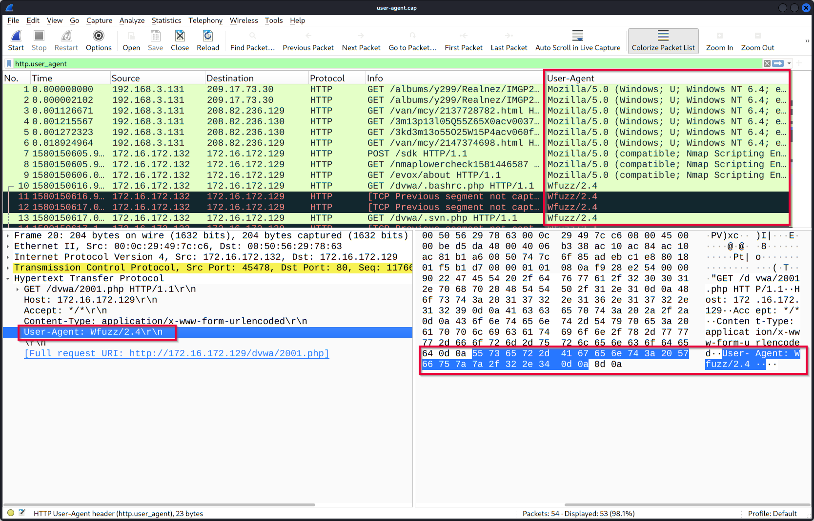
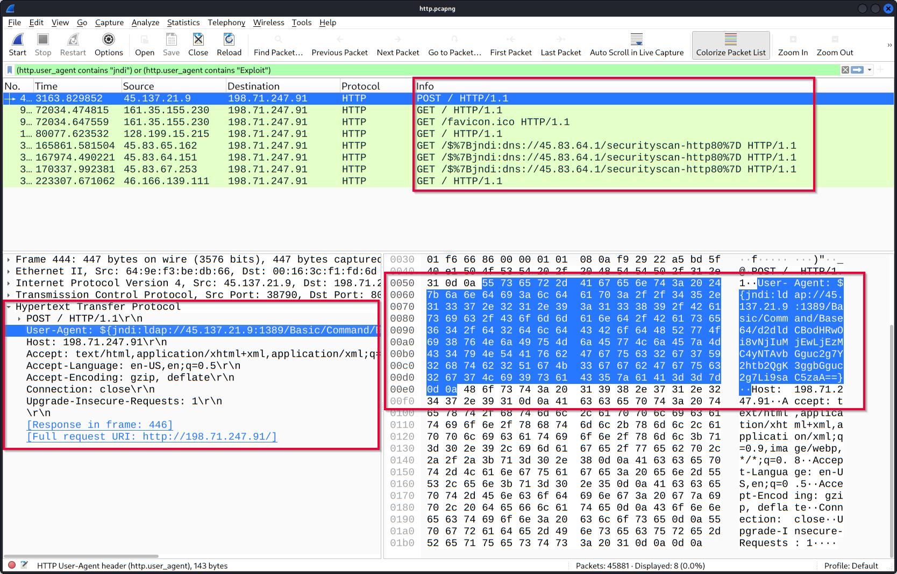

Lab: Network Traffic Analysis
Objective: Identify suspicious activity in a network capture.

What I did:

Used Wireshark to filter HTTP and DNS traffic.

Investigated suspicious IPs using OSINT tools (like AbuseIPDB).

Mapped the findings to MITRE ATT&CK (e.g., T1071 - Application Layer Protocol).

Key Learning: Learned how to identify "beaconing" patterns (regular heartbeats) from infected hosts.

